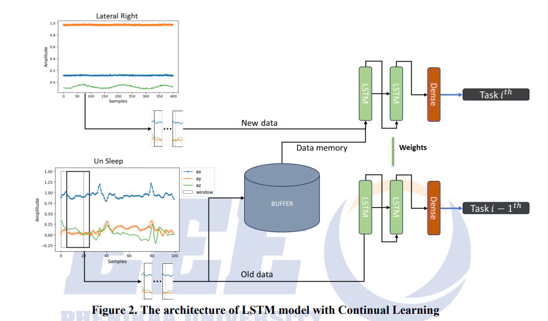
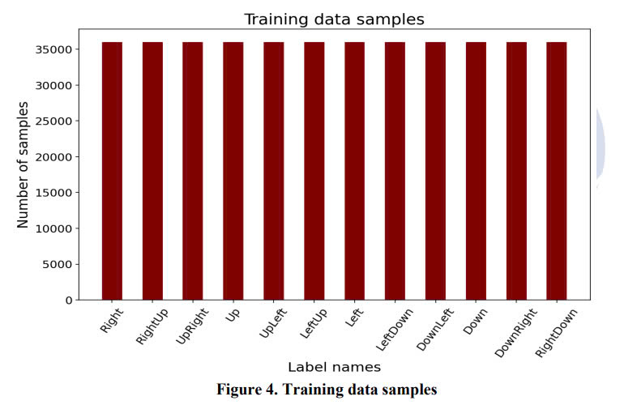
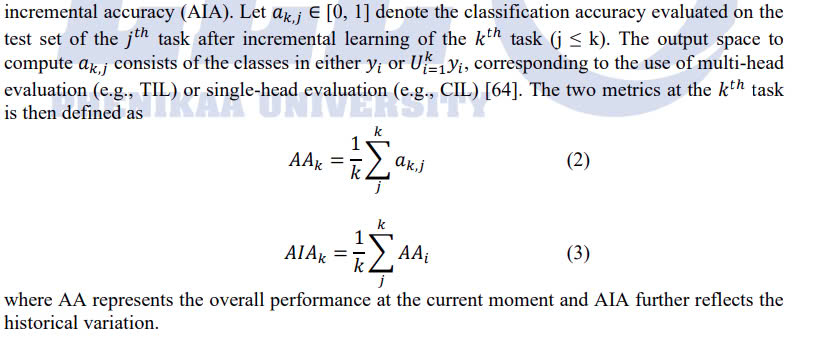
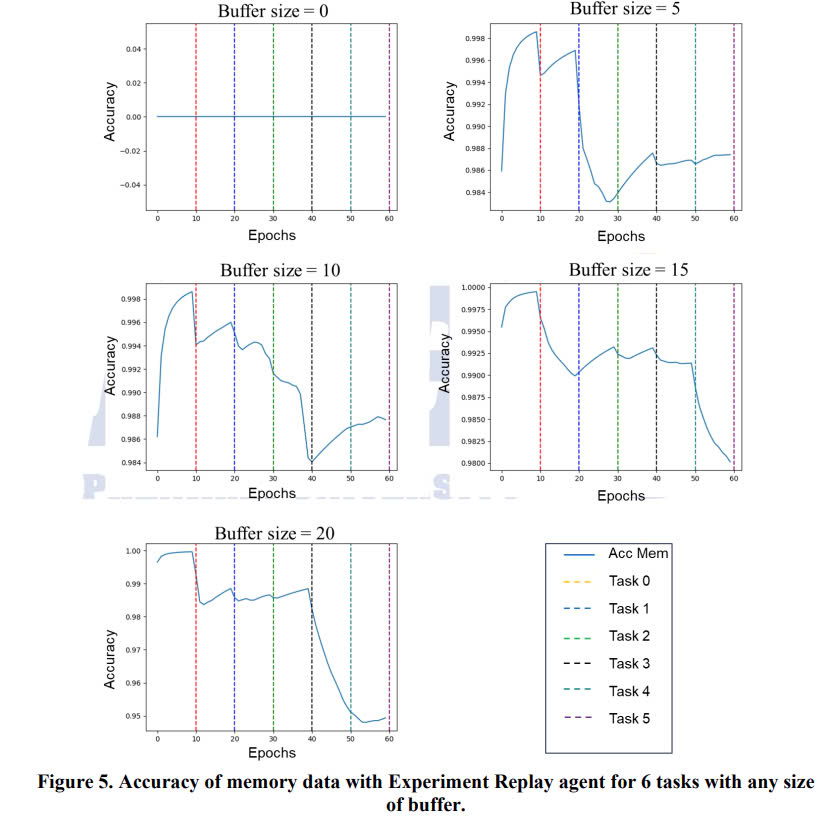
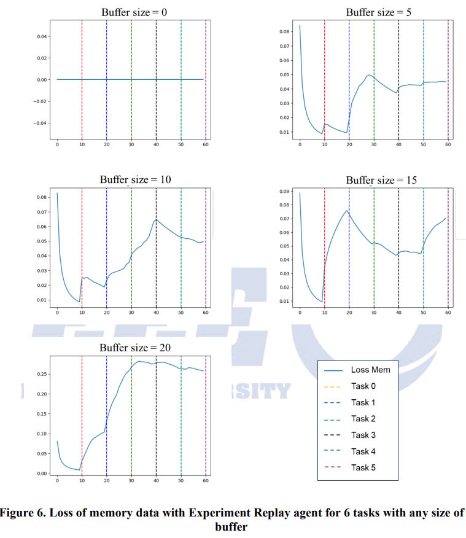
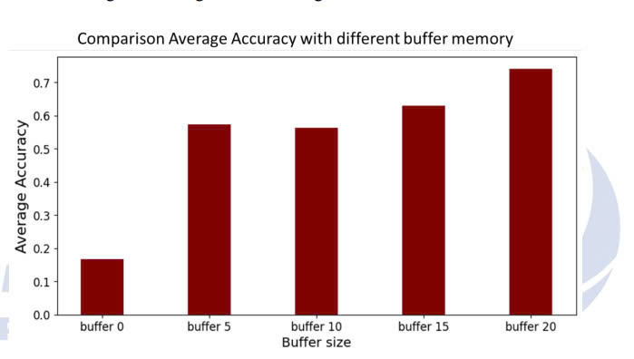
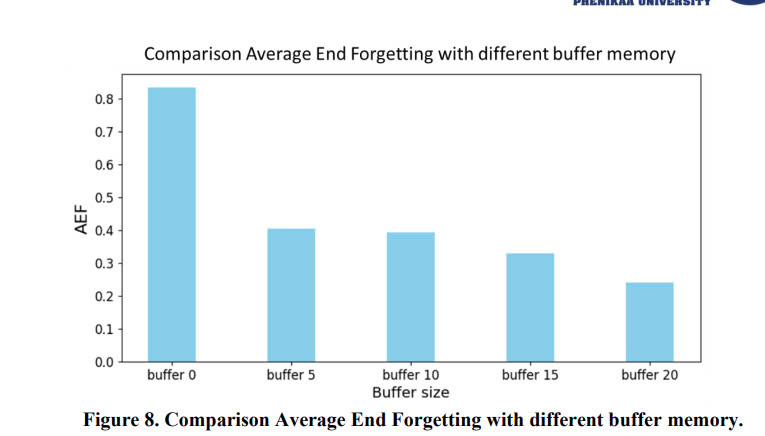
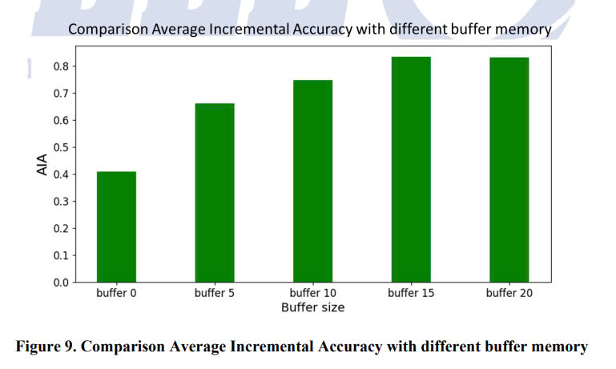
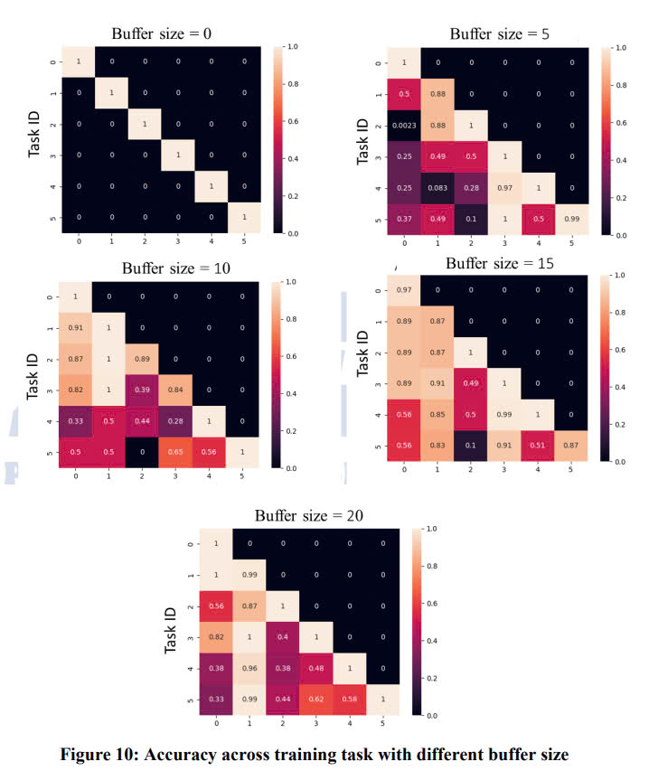
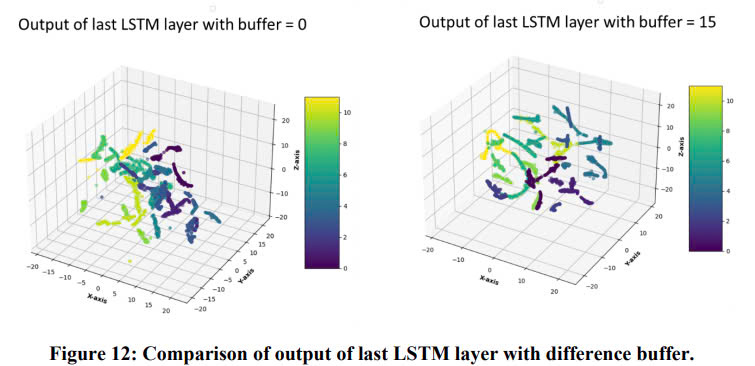

# Federated_Continual_Learing

## Study: Appling Continual Learning in Sleep Posture Classification System

## Abtract 

---

It has been well established that sleep posture plays a key role in sleep quality 
monitoring. Consequently, many noncontact and wearable devices, whose systems rely on 
sensors such as cameras, radar, wireless, and accelerometers, have been developed to 
classify sleep positions and postures. However, noncontact systems were often unsuccessful 
when facing limited conditions such as low light and physical obstacles. On the other hand, 
other systems currently in research, which involve wearable devices, may have used 
machine learning models but have not competently exploited other more accurate deep 
learning models. Realizing that, we proposed a deep learning model capable of learning 
and classifying sleeping positions. We apply continuous learning to our model so that the 
deep learning model can learn many new tasks and sleeping positions without forgetting 
previously learned knowledge. In this study, we achieved an accuracy of up to 82% with 
the experiment replay method.

Keywords – sleep posture, deep learning, accelerometer, continual learning, life-long learning, experiment-replay method. 

## The Architecture of LSTM-CL
In our study, all samples were naturally applied to a model of deep learning techniques 
which can perform more effectively on big data than machine learning models do. Theoretically, 
the values of signals 𝑎𝑥
𝑡
, 𝑎𝑦
𝑡
and 𝑎𝑧
𝑡
 were represented in the time domain, where 𝑎𝑥, 𝑎𝑦 and 𝑎𝑧
correspond to the acceleration signals of the three axes of the accelerometer, and t denotes the 
timestamp of the signal. The data analyzing module employed a novel neural network named 
Sequential LSTM (LSTM_sq), the architecture of which is presented in Figure 2. The model was 
9
the combination of two LSTM layers with hidden size: 64 and 128 respectively, one fully 
connected layer as output classifier has hidden size 12, and the Dropout layers with ratio of 0.25. 
It can exploit LSTM with a window sliding on features.

## Datasets

Dataset was collected from 16 teenagers in both males and females with various static sleep 
postures (12 classes). The average age of teenager is 21 ± 1 years. The data carries information 
about the sleep postures of people on 3 axes X, Y and Z. Each teenager measures data in one 
minute for each sleep posture. Following utilization of an accelerometer to capture the breathing 
data of each participant across various sleeping positions, this work documented the sleep 
postures for each measurement. Subsequently, a nomenclature was assigned to each data file, 
encompassing the participant’ name, sleeping position, and the corresponding breathing rate. 
Ultimately, a total of 192 data files were collected with each file containing 3000 data samples.
All training samples in each class are balance. 

## Metrics

In general, the performance of continual learning can be evaluated from three aspects: overall 
performance of the tasks learned so far, memory stability of old tasks, and learning plasticity of 
new tasks. Here we summarize the common evaluation metrics, using classification as an 
example.
Overall performance is typically evaluated by average accuracy (AA) [64], [285] and average 
incremental accuracy (AIA). 

## Results

The study was setup to train model with many size of memory buffer to show how change of 
model’s performance when learning new task. Firstly, dataset was seprated into two set: training 
17
set and testing set. For training set, it contains data of 12 peoples and the rest for testing set. 
There are 12 classes which randomly devide into 6 tasks, each task has 2 classes. Model was 
trained step by step for every task. When completely training in one task, a few old training 
samples in previous task are stored in a small memory buffer. Then, these memory data are input 
of model combine with new training sample in next task. In this study, we do experiment with 
five size of memory buffer: 0, 5, 10 , 15, and 20.

As shown in Figure 5, the accuracy of our model changes for each buffer size. For each 
buffer size, a few old training samples which stored in a small buffer memory. Before training 
for 10 epochs, buffer had retrieved data in buffer memory, then model had evaluated them. In the 
first figure, with buffer size 0, it means that there is no data in buffer memory, so that is why the 
accuracy is always equal to zero. In other figures, buffer memory will be increased by 5 samples 
after each experiment. The trend of accuracy curve in all figures often go down arcoss each task. 
Comparing accuracy of model at buffer size 20 and others, the accuracy of model at buffer size 
19
20 is clearly smaller than others, althouth it has higher memory size. So, It can be an initial 
conclusion that accuracy at the buffer memory gets smaller when increasing the buffer size but 
the more data in the buffer size, the more confident the model evaluation. Similarly, we also 
calculated loss value in each task, the loss value in buffer size 20 is higher than others.

## Evaluation
As mentioned above, we evaluate the model with AA (Average Accuracy) and AIA (Average
Incremental Accuracy) metrics, and we also evaluate the model's forgetting level (Average End 
Forgetting). Average Accuracy is measured when the model evaluates on the test set of the last 
task. Average Incremental Accuracy is calculated by sum of all classification’s accuracy 
evaluated from the first task to the last task. Average End Forgetting (AEF) is used to estimate 
how much model forget knowledge across training tasks. 

In Figure 8, we evaluate the forgetting level of the model. It is easy to see, when the model has no 
data in buffer memory, the level of forgetting of the model is evident when the AEF value reaches more 
than 83% (buffer size is 0). Meanwhile, when gradually increasing the buffer size, the model has 
significantly better memorization and achieves 25% less AEF value with buffer size 20

In Figure 9, we have calculated the AIA value of the model through each test. The AIA value 
increases gradually with each buffer size. We performed an evaluation on the test set, and we can see that 
the model has a good AIA when it reaches a value of more than 82%.

### Confusion Matrix

In Figure 10, with buffer size 0, the accuracy across training task is equal to 1 in the orthogonal line. 
Because having no data in buffer memory, therefore, accuracy value at other tasks equals to zero. For 
others, a few old samples data which are stored in buffer memory are retrieved to evaluate per task. 
22
Normally, the model will forget knowledge of previous task before leaning new task with different label. 
Our study tries to remember previous knowledge and still able to classify new labels in the next task.

## Discussion
n Figure 12, the data is passed through the LSTM model, and visualized after the final 
LSTM layer. We can easily see that, in the first image with buffer size = 5, the data points are 
arranged haphazardly, and it is difficult to see their separation. Meanwhile, in the second figure, 
the data points have a separate distribution, and can be classified more clearly. This also 
demonstrates why models with higher buffer sizes have better classification quality.

Continuous learning is a learning method that helps the model remember previously learned 
knowledge and continue learning new tasks. This is different from conventional supervised 
learning methods, when learning a new task, the model tends to forget previous knowledge and 
only focuses on the currently learned knowledge. In this study, we applied continuous learning to 
the sleeping position classification problem. Our model achieves quite good results when it can 
classify other classes without having to relearn all the knowledge from the previous class. 
However, this approach is not optimally effective when the memory storage problem has not 
been resolved.

## Conclusion

In this study, we applied continuous learning to the sleeping position classification problem. 
The results achieved more than 82% of model accuracy. In addition, we studied the change in the 
level of forgetting when using a replay-based approach, specifically experiment replay. In future 
work, we will experiment more with representative-based approaches. And apply the model to 
the microcontroller.

